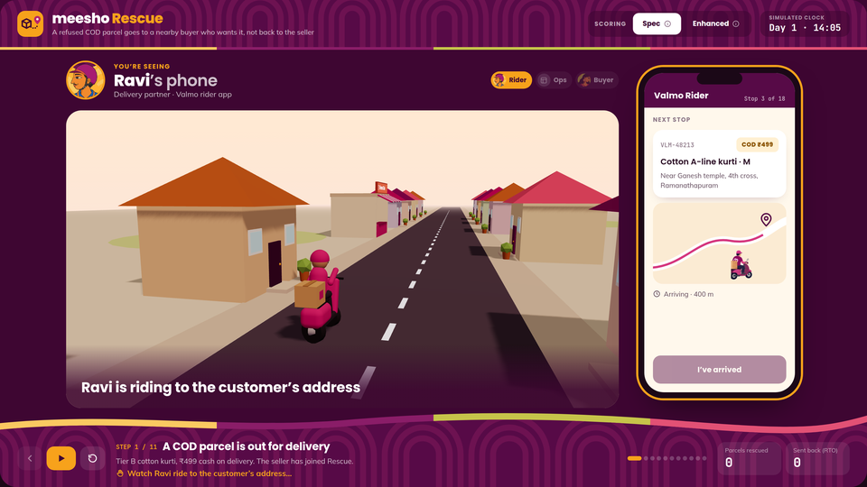
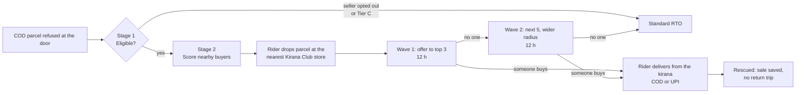
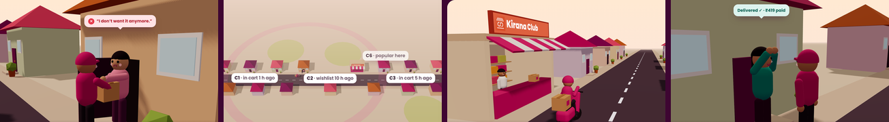
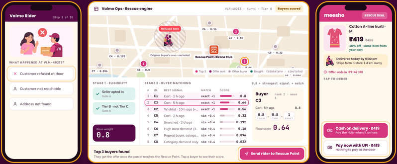

# Meesho Rescue

**When a cash-on-delivery parcel is refused at the door, sell it to a nearby buyer who already wants it, instead of shipping it all the way back to the seller.**

Built by team *The Edge Cases* (IIT Madras) for the Meesho DICE Challenge Season 3, Valmo business track: *“Reducing RTO: getting more orders delivered.”*

**▶ Live demo: [meesho-rescue.vercel.app](https://meesho-rescue.vercel.app/)**



---

## The problem

On Valmo, an order that isn't delivered goes back to the seller (RTO, return to origin), and Valmo pays for both the forward and the reverse trip. Cash on delivery makes it easy to change your mind at the doorstep, so refusals are a big share of RTO. These parcels are perfectly good. They just have no buyer at that moment.

## The solution

Rescue gives a refused parcel a second chance, close to where it already is:



**Scoring (exactly as in [the spec](research/Meesho.pdf)):**

- **Stage 1, eligibility.** The seller must have opted in, and the item's tier sets a base weight: Tier A = 1.0, Tier B = 0.8, Tier C = 0 (not eligible).
- **Stage 2, buyer matching.** Each nearby buyer gets up to three signals:
  - cart or wishlist, scored by how recent it is;
  - recent searches;
  - regional demand.

  **Only the strongest signal counts; signals are never added together.**
- **Final score** = base weight × strongest signal × match multiplier (exact SKU or similar item). The top 3 buyers get the offer first.
- **Enhanced mode** (our extension) multiplies that score by an intent score from a model of past cart behaviour, so idle carts drop down the list.



*Refused at the door → nearby buyers found → parcel held at a Kirana Club store → delivered to the buyer.*

---

## The demo app

An interactive prototype for presenting to business audiences. Only one device is on screen at a time, next to a 3D scene of what is happening in the real world:

| On screen | Who | What it shows |
| --- | --- | --- |
| Ravi's phone | Delivery partner, Valmo rider app | Arrive, mark refused, drop at the kirana, deliver |
| Valmo ops | Rescue engine | Live map, Stage 1 gates, Stage 2 scoring table with the real formula |
| Kavya's phone | Nearby buyer (C3), Meesho app | Push notification, offer, cash on delivery or UPI, tracking, delivered |



- **Story:** 11 steps and 8 taps. A spotlight with a tapping hand shows exactly what to press next.
- **Endings:** either the parcel is rescued, or you choose “What if nobody buys?” in Wave 1 to see Wave 2 and then a normal return.
- **Spec vs Enhanced:** the toggle re-ranks the buyers live.

> **All data in the demo is simulated.** Buyers, parcels, prices, times, the map and the intent values are hand-made demo data, not Meesho data.

### Try it

Open the live demo at **[meesho-rescue.vercel.app](https://meesho-rescue.vercel.app/)**, or run it locally:

Requires Node 18 or later.

```bash
cd app
npm install
npm run dev        # http://localhost:5173
npm run build      # static build in app/dist
```

**Presenting:**
- Tap the highlighted control at each step.
- **▶** autoplays the rescue path.
- **← / →** (or a slide clicker) step back and forward.
- The stage is 16:9 and scales to any screen.

### Tech

React 18 · Vite 5 · Framer Motion (UI animation) · three.js with react-three-fiber and drei (3D town). There is no backend; the scoring engine runs in the browser.

---

## Repository layout

```
.
├── app/                     the demo (React + Vite)
│   └── src/
│       ├── App.jsx          stage layout, story state machine, autoplay, keyboard
│       ├── flow.js          every step: who acts, captions, what to tap next
│       ├── engine.js        Stage 1 + Stage 2 scoring (the spec formula) and the simulated buyers
│       ├── Town3D.jsx       3D town, characters, vehicles and camera shots
│       ├── Scene.jsx        scene panel: 3D view plus caption
│       ├── RiderPhone.jsx   Ravi's phone screens
│       ├── BuyerPhone.jsx   Kavya's phone screens
│       ├── OpsConsole.jsx   ops map, scoring table, action bar
│       ├── Spotlight.jsx    “tap here” coach-mark
│       ├── Background.jsx   header and footer bands, logo
│       ├── ui.jsx           icons, Hint wrapper, animation presets
│       └── assets/          illustrations from our deck, Kirana Club logo
├── research/                problem statement, scoring spec, research pack, previous-round deck
└── docs/                    the three images in this README
```

| Research file | What it is |
| --- | --- |
| [DICE Challenge S3 Valmo Case studies](research/DICE%20Challenge%20S3%20%20Valmo%20Case%20studies%20(1).pdf) | Problem statement |
| [Meesho.pdf](research/Meesho.pdf) | Rescue eligibility and search-engine scoring spec |
| [Prototype Spec & Research Pack](research/Meesho%20Rescue_%20Prototype%20Spec%20%26%20Research%20Pack.md) | Build spec, corrections, data sources, realism rules |
| [TheEdgeCases_IITMadras.pdf](research/TheEdgeCases_IITMadras.pdf) | Our previous-round deck (research, prioritisation, solution flows) |

---

## Status

### Done

- [x] Interactive end-to-end demo: refusal → eligibility → scoring → kirana hold → offer waves → delivery, plus the “nobody buys” → RTO path
- [x] Scoring engine that follows the spec exactly (two stages, max-not-sum rule, exact vs similar multiplier, top-N ranking). It reproduces the spec's worked examples: **0.64** (C3) and **0.192** (C4).
- [x] Spec / Enhanced toggle that re-ranks buyers live (Enhanced uses placeholder intent values)
- [x] Realism rules from the research pack:
  - the original buyer's area is excluded;
  - at most one push per buyer per day;
  - two 12 h waves, then RTO;
  - rescue price about 16% off;
  - the buyer can choose cash on delivery or UPI.
- [x] Rider, ops and buyer views with a guided spotlight, autoplay, keyboard control and a crash guard
- [x] 3D scene with camera shots for every step; Kirana Club branding

### Pending

**Intent model (Enhanced mode).** The intent values in `app/src/engine.js` are hand-set placeholders.
- [ ] Train a gradient-boosting purchase-intent model with **XGBoost** and **LightGBM**, and compare them on PR-AUC, recall and F1. The data is heavily imbalanced (about 7:1 to 35:1 non-purchase to purchase), so use class weights.
- [ ] Features, as reasoned in the research pack:
  - item view count;
  - time since last interaction;
  - wishlist → cart moves;
  - the buyer's past cart-to-order rate;
  - past COD refusals (counts against the buyer);
  - cart size.
- [ ] SHAP explanations per candidate, shown in the scoring inspector
- [ ] Replace Signal 1's step buckets with a smooth decay in Enhanced mode, keeping the max rule and the final formula unchanged
- [ ] Export the model and serve scores to the app

**Datasets.** Links come from the research pack; the ones marked *verify* were not checked.
- [ ] [REES46 multi-category store events](https://www.kaggle.com/datasets/mkechinov/ecommerce-behavior-data-from-multi-category-store) (view / cart / remove / purchase). Kaggle login required, and the files are several GB, so use one month or a sample. [Loading example](https://nbviewer.org/format/script/github/recohut/notebook/blob/master/_notebooks/2021-06-19-recsys20-tutorial-feature-engineering-part-1.ipynb).
- [ ] *eCommerce Events History in Cosmetics Shop* (same author, Kaggle). *Verify:* search by name.
- [ ] *UCI Online Shoppers Purchasing Intention* (12,330 sessions). *Verify:* search by name; it has no cart fields.
- [ ] Imbalance reference paper: [arXiv 2102.01625](https://ar5iv.labs.arxiv.org/html/2102.01625)
- [ ] Code to adapt as a starting point:
  - [XGBoost + SHAP + Streamlit](https://github.com/Pradakshana3435/cart-abandonment-prediction)
  - [Gradient-boosting pipeline](https://github.com/grarun2001/online-shoppers-purchase-prediction)
- [ ] Map the behaviour patterns from these electronics and cosmetics datasets onto clothing SKUs

**Locations and simulation**
- [ ] Pull real kirana locations from OpenStreetMap using the Overpass API (`shop=convenience|general`) into `kirana.json`. Check coverage for the demo city first.
- [ ] Synthetic generator:
  - about 2,000 buyers with home pincode and nearest kirana;
  - about 5,000 events per buyer-week in REES46-like patterns;
  - about 200 parcels in tiers A, B and C, with seller opt-in flags.
- [ ] Real map (Leaflet + OpenStreetMap tiles) in place of the drawn ops map

**Backend and quality**
- [ ] FastAPI + SQLite backend with a simulated clock:
  - `POST /parcels/{id}/refuse`
  - `GET /parcels/{id}/candidates`
  - `POST /offers/{id}/accept`
  - `POST /sim/advance`
  - `GET /kirana?near=…`
- [ ] Unit tests for the scoring engine (both worked examples, gates, max rule)

**Open assumptions to tune with a mentor or survey**
- [ ] Rescue radius (default 10 km)
- [ ] Wave timings: the demo uses 12 h + 12 h, while our deck says the kirana holds the parcel for 2 days
- [ ] Rescue discount (10 to 20%)
- [ ] The kirana handling fee (₹12, from our deck's payout table)

---

## License

The code is released under the [MIT License](LICENSE).

The following belong to their respective owners and are **not** covered by this license:
- the Meesho, Valmo and Kirana Club names and logos;
- the DICE Challenge case study and scoring spec PDFs in `research/`;
- the illustrations taken from our previous-round deck.

They are included only to present this case-study submission.
