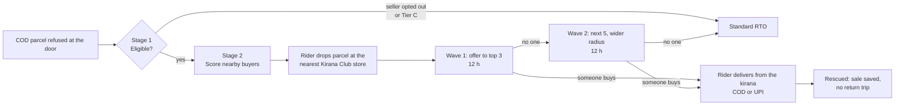

# Meesho Rescue

**When a cash-on-delivery parcel is refused at the door, sell it to a nearby buyer who already wants it, instead of shipping it all the way back to the seller.**

Built by team *The Edge Cases* (IIT Madras) for the Meesho DICE Challenge Season 3, Valmo business track: *“Reducing RTO: getting more orders delivered.”*

**▶ Live demo: [meesho-rescue.vercel.app](https://meesho-rescue.vercel.app/)**


---

## The problem

On Valmo, an order that isn't delivered goes back to the seller (RTO, return to origin), and Valmo pays for both the forward and the reverse trip. Cash on delivery makes it easy to change your mind at the doorstep, so refusals are a big share of RTO. These parcels are perfectly good. They just have no buyer at that moment.

## The solution

Rescue gives a refused parcel a second chance, close to where it already is:



**Scoring (exactly as in [the spec](research/Meesho.pdf)):**

- **Stage 1, eligibility.** The seller must have opted in, and the item's tier sets a base weight: Tier A = 1.0, Tier B = 0.8, Tier C = 0 (not eligible).
- **Stage 2, buyer matching.** Each nearby buyer gets up to three signals:
  - cart or wishlist, scored by how recent it is;
  - recent searches;
  - regional demand.

  **Only the strongest signal counts; signals are never added together.**
- **Final score** = base weight × strongest signal × match multiplier (exact SKU or similar item). The top 3 buyers get the offer first.
- **Enhanced mode** (our extension) multiplies that score by an intent score from a model of past cart behaviour, so idle carts drop down the list.


*Refused at the door → nearby buyers found → parcel held at a Kirana Club store → delivered to the buyer.*

---

## The demo app

An interactive prototype for presenting to business audiences. Only one device is on screen at a time, next to a 3D scene of what is happening in the real world:

| On screen | Who | What it shows |
| --- | --- | --- |
| Ravi's phone | Delivery partner, Valmo rider app | Arrive, mark refused, drop at the kirana, deliver |
| Valmo ops | Rescue engine | Live map, Stage 1 gates, Stage 2 scoring table with the real formula |
| Kavya's phone | Nearby buyer (C3), Meesho app | Push notification, offer, cash on delivery or UPI, tracking, delivered |


- **Story:** 11 steps and 8 taps. A spotlight with a tapping hand shows exactly what to press next.
- **Endings:** either the parcel is rescued, or you choose “What if nobody buys?” in Wave 1 to see Wave 2 and then a normal return.
- **Spec vs Enhanced:** the toggle re-ranks the buyers live.

> **All data in the demo is simulated.** Buyers, parcels, prices, times, the map and the intent values are hand-made demo data, not Meesho data.

### Try it

Open the live demo at **[meesho-rescue.vercel.app](https://meesho-rescue.vercel.app/)**, or run it locally:

Requires Node 18 or later.

```bash
cd app
npm install
npm run dev        # http://localhost:5173
npm run build      # static build in app/dist
```

**Presenting:**
- Tap the highlighted control at each step.
- **▶** autoplays the rescue path.
- **← / →** (or a slide clicker) step back and forward.
- The stage is 16:9 and scales to any screen.

### Tech

React 18 · Vite 5 · Framer Motion (UI animation) · three.js with react-three-fiber and drei (3D town). There is no backend; the scoring engine runs in the browser.

---

## Status

**Done**
- [x] Interactive end-to-end demo with rider, ops and buyer views, a 3D scene, guided taps and autoplay, covering both the rescued and the “nobody buys” → RTO paths
- [x] Scoring engine that follows the spec exactly. It reproduces the spec's worked examples: **0.64** and **0.192**.
- [x] Realism rules: the original buyer's area is excluded, one push per buyer per day, two 12 h waves, a discounted rescue price, cash on delivery or UPI

**Pending**
- [ ] **Intent model:** train XGBoost and LightGBM purchase-intent models (class-weighted, compared on PR-AUC and F1, with SHAP explanations) and replace the placeholder intent values in `app/src/engine.js`
- [ ] **Training data:** [REES46 e-commerce events](https://www.kaggle.com/datasets/mkechinov/ecommerce-behavior-data-from-multi-category-store) ([loading example](https://nbviewer.org/format/script/github/recohut/notebook/blob/master/_notebooks/2021-06-19-recsys20-tutorial-feature-engineering-part-1.ipynb)), plus the Kaggle *Cosmetics Shop* and UCI *Online Shoppers Purchasing Intention* datasets (both links still to verify). Imbalance reference: [arXiv 2102.01625](https://ar5iv.labs.arxiv.org/html/2102.01625).
- [ ] **Starter code to adapt:** [XGBoost + SHAP](https://github.com/Pradakshana3435/cart-abandonment-prediction) and [gradient-boosting pipeline](https://github.com/grarun2001/online-shoppers-purchase-prediction)
- [ ] **Real locations:** kirana stores from the OpenStreetMap Overpass API (`shop=convenience|general`), shown on a Leaflet map
- [ ] **Synthetic data generator:** buyers, events and parcels, replacing the hand-made demo data
- [ ] **Backend and tests:** a FastAPI + SQLite API with a simulated clock, plus unit tests for the scoring engine
- [ ] **Tune assumptions:** rescue radius (10 km), hold window (12 h + 12 h in the demo vs 2 days in our deck), discount (10 to 20%), kirana fee (₹12)

Research documents (problem statement, scoring spec, research pack, previous-round deck) are in [`research/`](research).

---

## License

The code is released under the [MIT License](LICENSE).

The following belong to their respective owners and are **not** covered by this license:
- the Meesho, Valmo and Kirana Club names and logos;
- the DICE Challenge case study and scoring spec PDFs in `research/`;
- the illustrations taken from our previous-round deck.

They are included only to present this case-study submission.
